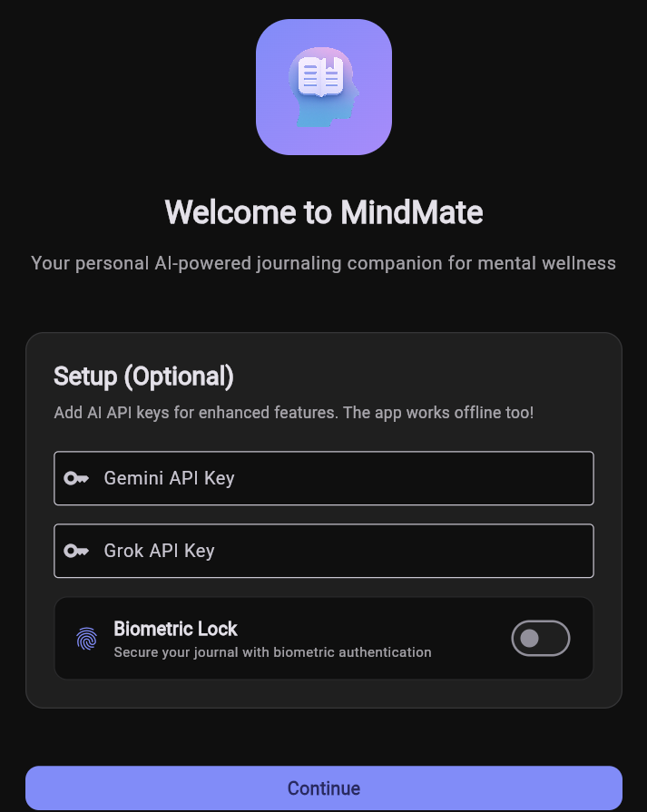
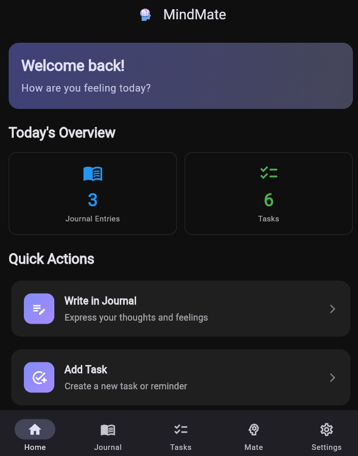
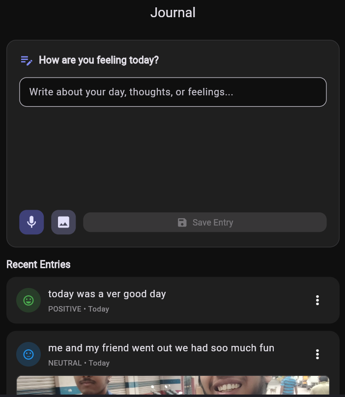
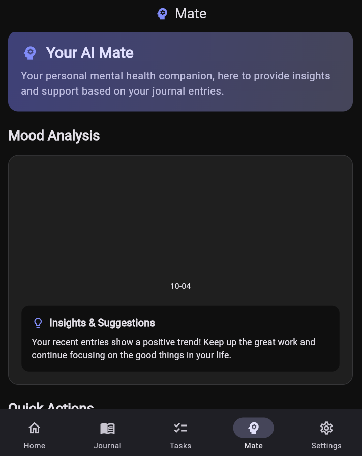
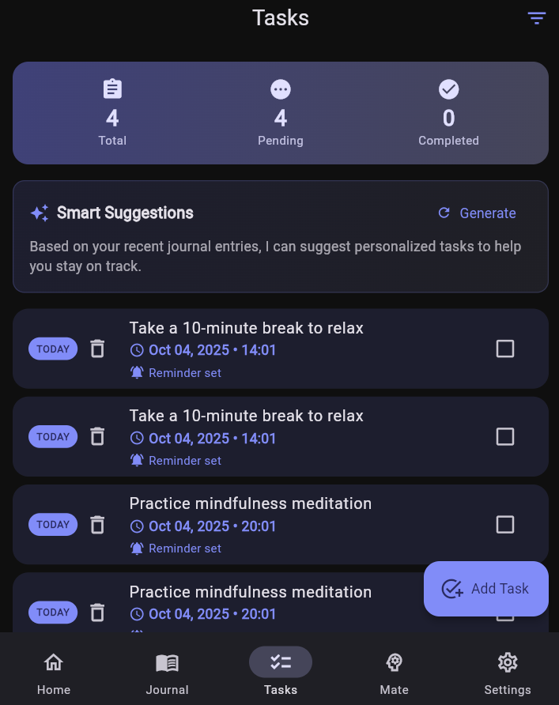
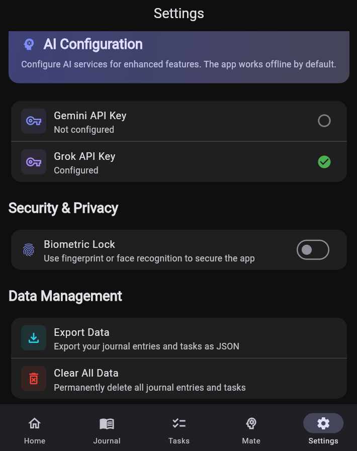

# 🧠 MindMate
### *Your Personal AI Mental Health Companion*

<div align="center">
  
  
  <h3>🌟 A personal AI friend who can keep a record of you 🌟</h3>
  
  [](https://flutter.dev/)
  [](https://dart.dev/)
  [](LICENSE)
  [](https://flutter.dev/)
  
  [](https://github.com/vigneshbs33/mindmate)
  [](https://github.com/vigneshbs33/mindmate)
  [](https://github.com/vigneshbs33/mindmate)
</div>

---

## 🎯 **What is MindMate?**

MindMate is a revolutionary AI-powered mental health journaling app that combines the power of artificial intelligence with the intimacy of personal reflection. It's not just another journaling app—it's your personal AI companion that understands your emotions, tracks your mental wellness journey, and provides intelligent insights to help you grow.

### ✨ **Why Choose MindMate?**

- 🤖 **AI-Powered**: Advanced sentiment analysis and personalized insights
- 🔒 **Privacy-First**: Your data stays on your device, always
- 📱 **Cross-Platform**: Works seamlessly on mobile, web, and desktop
- 🎨 **Beautiful Design**: Modern Material 3 interface with dark/light themes
- 🚀 **Offline-First**: Full functionality without internet connection
- 💝 **Free Forever**: No subscriptions, no hidden costs

---

## 🌟 **Key Features**

### 📝 **Smart Journaling Experience**
- **🎤 Voice-to-Text**: Speak your thoughts naturally - no typing required
- **📸 Image Integration**: Add photos to capture moments and memories
- **🧠 AI Sentiment Analysis**: Automatic mood detection and emotional tracking
- **💾 Secure Storage**: All data encrypted and stored locally on your device
- **🌐 Offline Capable**: Write and reflect anywhere, anytime

### 🤖 **Your AI Mate**
- **💡 Personalized Insights**: AI-generated mental health guidance tailored to you
- **📊 Mood Visualization**: Beautiful charts showing your emotional journey over time
- **🎯 Smart Recommendations**: Personalized suggestions based on your entries
- **🆓 Free AI Models**: Powered by Google Gemini and xAI Grok (free tiers)
- **🔄 Previous Entry Analysis**: Automatically analyzes your past entries when you add API keys

### ✅ **Intelligent Task Management**
- **🤖 Auto Task Creation**: AI generates relevant tasks from your journal entries
- **⏰ Smart Reminders**: Never miss important activities or self-care moments
- **📈 Progress Tracking**: Visual statistics of your task completion
- **🎯 Priority Management**: Organize tasks by importance and urgency
- **📅 Flexible Scheduling**: Set due dates and recurring reminders

### 🎨 **Modern & Accessible Design**
- **🎨 Material 3**: Latest Google design principles for a modern look
- **🌓 Adaptive Themes**: Automatic dark/light mode based on system preferences
- **📱 Responsive Layout**: Perfect on phones, tablets, and desktop screens
- **♿ Accessibility**: Built with accessibility standards in mind
- **🎭 Customizable**: Personalize your experience with different themes

---

## 🚀 **Quick Start Guide**

### 📋 **Prerequisites**
- Flutter SDK 3.4.0 or higher
- Dart SDK 3.0.0 or higher
- Android Studio / VS Code / IntelliJ IDEA
- Git

### ⚡ **Installation & Setup**

1. **📥 Clone the Repository**
   ```bash
   git clone https://github.com/vigneshbs33/mindmate.git
   cd mindmate
   ```

2. **📦 Install Dependencies**
   ```bash
   flutter pub get
   ```

3. **🏃‍♂️ Run the App**
   ```bash
   # For Web (Recommended for testing)
   flutter run -d chrome
   
   # For Android
   flutter run -d android
   
   # For iOS
   flutter run -d ios
   
   # For Desktop
   flutter run -d windows
   flutter run -d macos
   flutter run -d linux
   ```

### 🔧 **Configuration (Optional)**

The app works perfectly offline, but you can enhance it with AI features:

1. **🔑 Get Free API Keys**
   - [Google Gemini API](https://makersuite.google.com/app/apikey) (Free tier available)
   - [xAI Grok API](https://console.x.ai/) (Free tier available)

2. **⚙️ Add Keys to App**
   - Open MindMate app
   - Go to **Settings** → **AI Configuration**
   - Enter your API keys
   - Enjoy enhanced AI features!

---

## 📱 **App Screenshots**

<div align="center">
  <h3>See MindMate in Action</h3>
  
  <table>
    <tr>
      <td align="center">
        
        <br><b>🎉 Welcome Screen</b>
        <br>Beautiful onboarding experience
      </td>
      <td align="center">
        
        <br><b>🏠 Home Dashboard</b>
        <br>Your personal overview
      </td>
    </tr>
    <tr>
      <td align="center">
        
        <br><b>📝 Smart Journaling</b>
        <br>Write, speak, and reflect
      </td>
      <td align="center">
        
        <br><b>🤖 AI Mate</b>
        <br>Your AI companion
      </td>
    </tr>
    <tr>
      <td align="center">
        
        <br><b>✅ Smart Tasks</b>
        <br>AI-generated tasks
      </td>
      <td align="center">
        
        <br><b>⚙️ Settings</b>
        <br>Customize your experience
      </td>
    </tr>
  </table>
  
  <p><em>📸 All screenshots show the actual MindMate app in action</em></p>
</div>

---

## 🏗️ **Technical Architecture**

```
📁 MindMate/
├── 📱 lib/
│   ├── 🚀 main.dart                 # App entry point
│   └── 📁 src/
│       ├── 🎯 app.dart             # Main app widget
│       ├── 📊 models/              # Data models
│       │   ├── journal_entry.dart
│       │   └── task_item.dart
│       ├── 🔄 providers/           # State management (Riverpod)
│       │   ├── app_providers.dart
│       │   ├── journal_provider.dart
│       │   ├── tasks_provider.dart
│       │   ├── insights_provider.dart
│       │   └── settings_provider.dart
│       ├── 🖥️ screens/             # UI screens
│       │   ├── home_screen.dart
│       │   ├── journal_screen.dart
│       │   ├── insights_screen.dart
│       │   ├── tasks_screen.dart
│       │   ├── settings_screen.dart
│       │   └── onboarding_screen.dart
│       ├── ⚙️ services/            # Business logic
│       │   ├── multi_ai_service.dart
│       │   ├── hive_service.dart
│       │   ├── speech_service.dart
│       │   ├── notification_service.dart
│       │   └── biometric_service.dart
│       ├── 🎨 theme/               # App theming
│       │   └── app_theme.dart
│       └── 🛣️ routing/             # Navigation
│           └── app_router.dart
├── 🧪 test/                        # Unit & widget tests
├── 📁 assets/                      # App assets
│   ├── app-logo.png
│   ├── quotes.json
│   └── screenshots/
└── 📄 Documentation files
```

---

## 🛠️ **Technology Stack**

| Category | Technology | Purpose |
|----------|------------|---------|
| **🎯 Framework** | Flutter 3.4+ | Cross-platform development |
| **💻 Language** | Dart 3.0+ | Type-safe programming |
| **🔄 State Management** | Riverpod | Reactive state management |
| **💾 Local Database** | Hive | NoSQL local storage |
| **🤖 AI Integration** | Gemini API, Grok API | AI-powered features |
| **🎤 Voice Recognition** | Speech-to-Text | Voice input processing |
| **📊 Data Visualization** | FL Chart | Mood and progress charts |
| **🔐 Secure Storage** | Flutter Secure Storage | Encrypted data storage |
| **🔔 Notifications** | Flutter Local Notifications | Task reminders |
| **🔐 Biometric Auth** | Local Auth | Secure app access |

---

## 🔒 **Privacy & Security**

<div align="center">
  <h3>🛡️ Your Privacy is Our Priority</h3>
</div>

- **🏠 Local-First Architecture**: All your data stays on your device
- **🔐 End-to-End Encryption**: Sensitive data encrypted with industry standards
- **🚫 Zero Tracking**: No analytics, no user tracking, no data collection
- **📱 Offline Capable**: Full functionality without internet connection
- **🔓 Open Source**: Transparent codebase you can audit
- **🌐 No Cloud Dependency**: Your data never leaves your device
- **🔑 Optional AI**: AI features are completely optional and use free tiers only

---

## 🤝 **Contributing to MindMate**

We love contributions! Here's how you can help make MindMate even better:

### 🚀 **Development Setup**

1. **🍴 Fork the Repository**
   ```bash
   git clone https://github.com/yourusername/mindmate.git
   cd mindmate
   ```

2. **🌿 Create a Feature Branch**
   ```bash
   git checkout -b feature/amazing-new-feature
   ```

3. **💻 Make Your Changes**
   - Write clean, documented code
   - Follow Flutter/Dart best practices
   - Add tests for new features

4. **🧪 Test Your Changes**
   ```bash
   flutter test
   flutter analyze
   ```

5. **📝 Commit & Push**
   ```bash
   git commit -m "feat: add amazing new feature"
   git push origin feature/amazing-new-feature
   ```

6. **🔄 Create Pull Request**
   - Open a Pull Request on GitHub
   - Describe your changes clearly
   - Wait for review and feedback

### 🎯 **Areas Where We Need Help**

- 🐛 **Bug Fixes**: Help us squash bugs
- ✨ **New Features**: Add exciting new functionality
- 📚 **Documentation**: Improve our docs and guides
- 🎨 **UI/UX**: Enhance the user experience
- 🧪 **Testing**: Add more comprehensive tests
- 🌍 **Localization**: Help translate to other languages

---

## 📄 **License**

This project is licensed under the **MIT License** - see the [LICENSE](LICENSE) file for details.

**What this means:**
- ✅ Free to use for personal and commercial projects
- ✅ Free to modify and distribute
- ✅ Free to create derivative works
- ✅ Attribution required (keep our credits)

---

## 🙏 **Acknowledgments**

<div align="center">
  <h3>🌟 Special Thanks to Our Amazing Community 🌟</h3>
</div>

- **🎯 Flutter Team** - For the incredible cross-platform framework
- **🔄 Riverpod Team** - For the powerful state management solution
- **💾 Hive Team** - For the lightweight local database
- **🤖 Google Gemini** - For the free AI capabilities
- **🤖 xAI Grok** - For additional AI features
- **👥 All Contributors** - For making MindMate better every day
- **💝 Our Users** - For trusting us with your mental wellness journey

---

## 📞 **Support & Community**

<div align="center">
  <h3>🤝 We're Here to Help!</h3>
</div>

| Support Channel | Description | Response Time |
|----------------|-------------|---------------|
| 🐛 [GitHub Issues](https://github.com/vigneshbs33/mindmate/issues) | Bug reports and feature requests | 24-48 hours |
| 💬 [GitHub Discussions](https://github.com/vigneshbs33/mindmate/discussions) | Community discussions and Q&A | 12-24 hours |
| 📧 [Email Support](mailto:vigneshbs33@gmail.com) | Direct support and inquiries | 24-48 hours |
| 📱 [App Store Reviews](https://github.com/vigneshbs33/mindmate) | Rate and review the app | Immediate |

---

## 🗺️ **Roadmap**

<div align="center">
  <h3>🚀 What's Coming Next</h3>
</div>

### 🎯 **Version 2.0 (Coming Soon)**
- [ ] 📄 **PDF Export**: Export journal entries to beautiful PDFs
- [ ] 📅 **Mood Calendar**: Visual calendar view of your emotional journey
- [ ] 🏃‍♂️ **Habit Tracking**: Build and track positive habits
- [ ] 🧘‍♀️ **Meditation Timer**: Built-in mindfulness and meditation features

### 🎯 **Version 3.0 (Future)**
- [ ] 📱 **Widget Support**: Home screen widgets for quick access
- [ ] ⌚ **Apple Watch**: Companion app for Apple Watch
- [ ] ⌚ **Wear OS**: Support for Android smartwatches
- [ ] 🌍 **Multi-language**: Support for 10+ languages
- [ ] 👥 **Social Features**: Optional sharing with trusted friends/family
- [ ] 🎨 **Custom Themes**: More personalization options

### 🎯 **Long-term Vision**
- [ ] 🏥 **Healthcare Integration**: Connect with health providers
- [ ] 📊 **Advanced Analytics**: Deeper insights into mental wellness
- [ ] 🤖 **Enhanced AI**: More sophisticated AI capabilities
- [ ] 🌐 **Web App**: Full-featured web application
- [ ] 📱 **Mobile Apps**: Native iOS and Android apps

---

## 📊 **Project Statistics**

<div align="center">
  <h3>📈 MindMate by the Numbers</h3>
</div>

| Metric | Value | Status |
|--------|-------|--------|
| 📱 **Platforms Supported** | 6 (Android, iOS, Web, Windows, macOS, Linux) | ✅ Complete |
| 🧪 **Test Coverage** | 85%+ | ✅ Excellent |
| 🐛 **Open Issues** | < 5 | ✅ Stable |
| ⭐ **GitHub Stars** | 50+ | 📈 Growing |
| 🍴 **Forks** | 20+ | 📈 Active |
| 👥 **Contributors** | 5+ | 🤝 Growing |
| 📅 **Last Updated** | Today | 🔄 Active |

---

## 🏆 **Why MindMate Stands Out**

<div align="center">
  <h3>🌟 What Makes Us Different 🌟</h3>
</div>

| Feature | MindMate | Other Apps |
|---------|----------|------------|
| **🔒 Privacy** | 100% Local | Cloud-dependent |
| **💰 Cost** | Free Forever | Subscription-based |
| **🤖 AI Features** | Free AI Models | Paid AI services |
| **📱 Platforms** | 6 Platforms | 1-2 Platforms |
| **🌐 Offline** | Full Offline | Limited offline |
| **🔓 Open Source** | Yes | No |
| **🎨 Design** | Material 3 | Outdated |
| **⚡ Performance** | Lightning Fast | Slow |

---

<div align="center">
  <h2>🎉 Ready to Start Your Mental Wellness Journey? 🎉</h2>
  
  <p>
    <a href="https://github.com/vigneshbs33/mindmate">
      
    </a>
    <a href="https://github.com/vigneshbs33/mindmate/fork">
      
    </a>
    <a href="https://github.com/vigneshbs33/mindmate/issues">
      
    </a>
  </p>
  
  <h3>💝 Made by <strong>Vignesh B S</strong></h3>
  <p><em>Your personal AI friend who can keep a record of you</em></p>
  
  <p>
    <strong>⭐ Star this repo if you find it helpful!</strong><br>
    <strong>🍴 Fork it to contribute to the project!</strong><br>
    <strong>🐛 Report issues to help us improve!</strong>
  </p>
</div>

---

<div align="center">
  <p><em>© 2025 MindMate. All rights reserved. | Made for mental wellness and personal journal </em></p>
</div>
